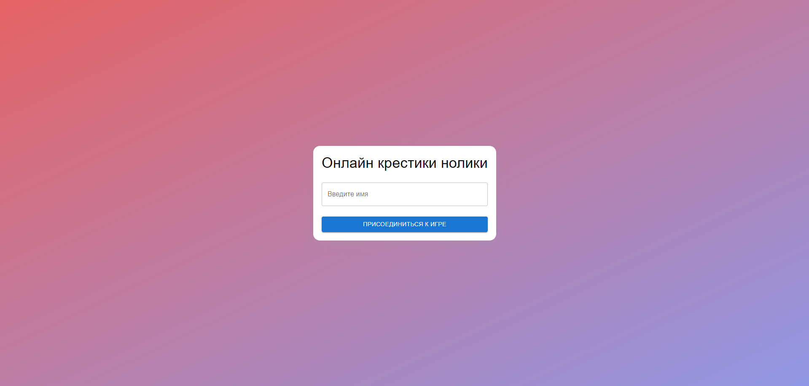
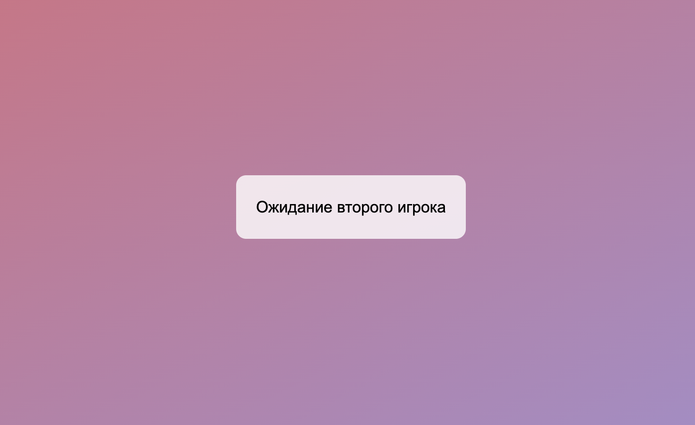
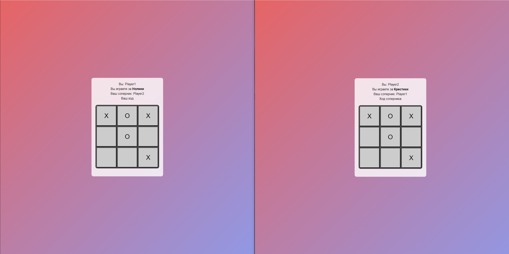
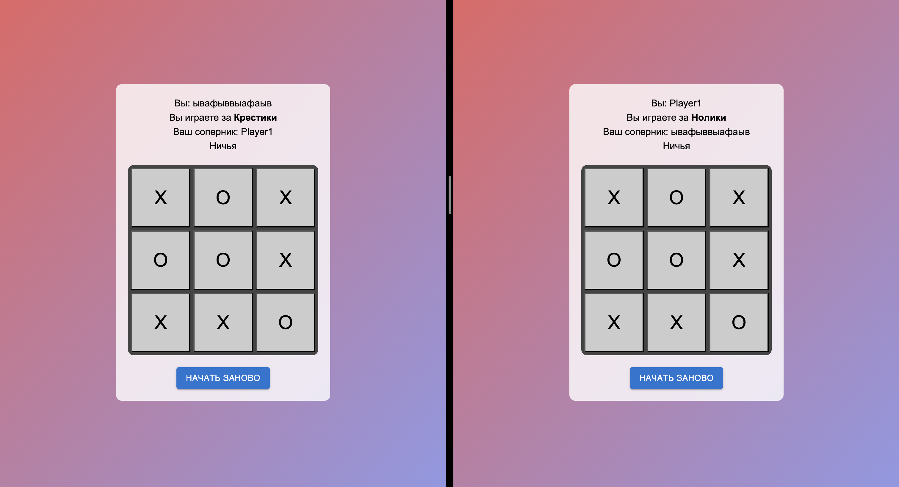
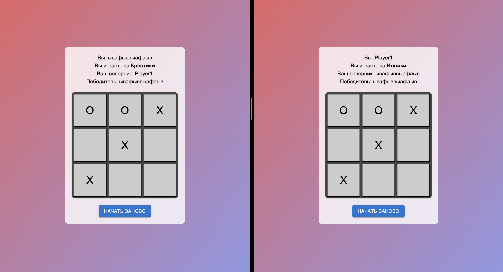
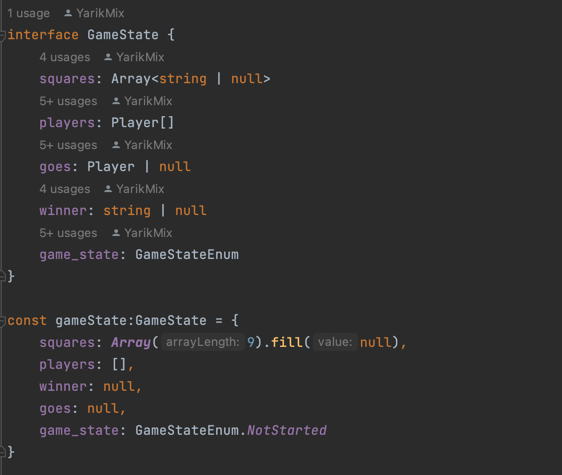
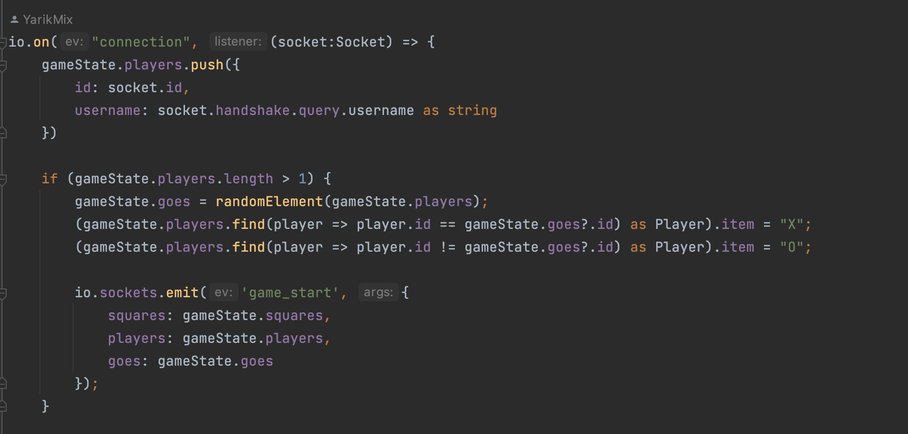
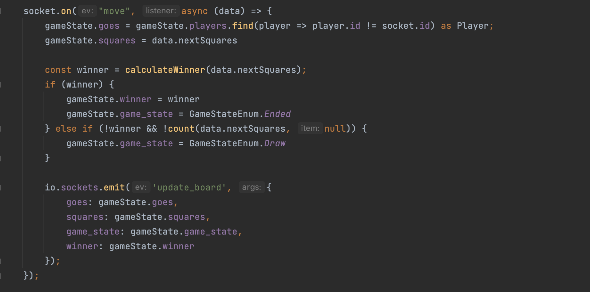
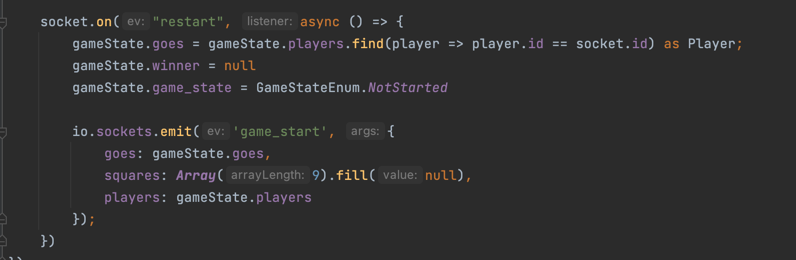

# Мультиплеерные крестики нолики

### Функционал

На главной странице приложения распологается форма для ввода имени игрока

После ввода имени игрок попадает в лобби, где ожидает подключения второго игрока

После подключения второго игрока начинается игра.
Ходящий игрок определяется случайным образом.
Игроки ходят по очереди.

В случае ничьи или победы одного из играков игра заканчивается. 
Игрокам предлагается возможность начать игру заново
Тот кто первый нажмет на кнопку "Начать заново" будет ходить первым

### Стэк технологий

* Фронтенд: React, Redux Toolkit, MUI, Socket.IO
* Бэкенд: Node.js, Socket.IO
* Другие технологии: Docker

### Техническая часть

Состояние игры хранится на веб сокет сервере в переменной gameState

При подключении клиента информация о нем заносится в массив players

Если к веб сокет серверу подключается второй клиент, то игра начинается

После каждого хода на веб сокет сервер отправляется событие move, в котором передается обновленное состояние игрового поля
Затем идет определение возможного победителя.

После победы или ничьи, когда один из игроков перезапустит игру - на веб сокет сервер отправится событие restart_game, которое обнулит состояние игры

